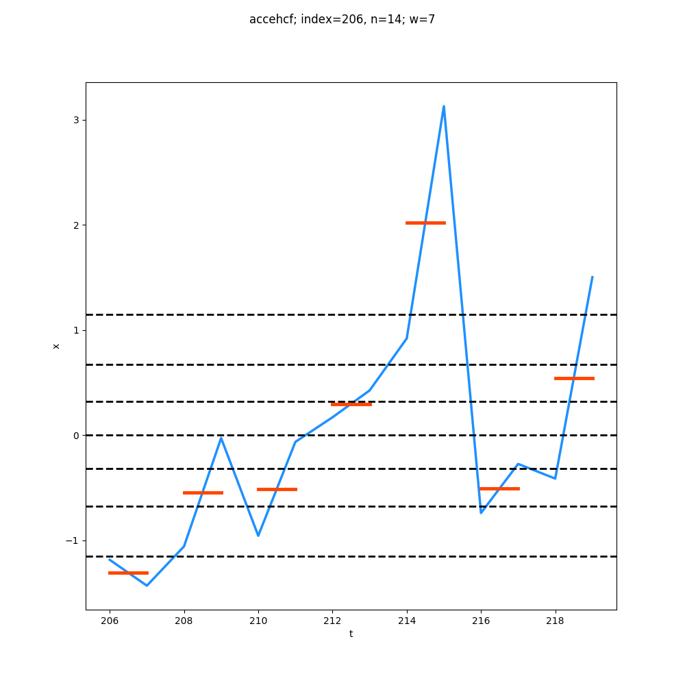
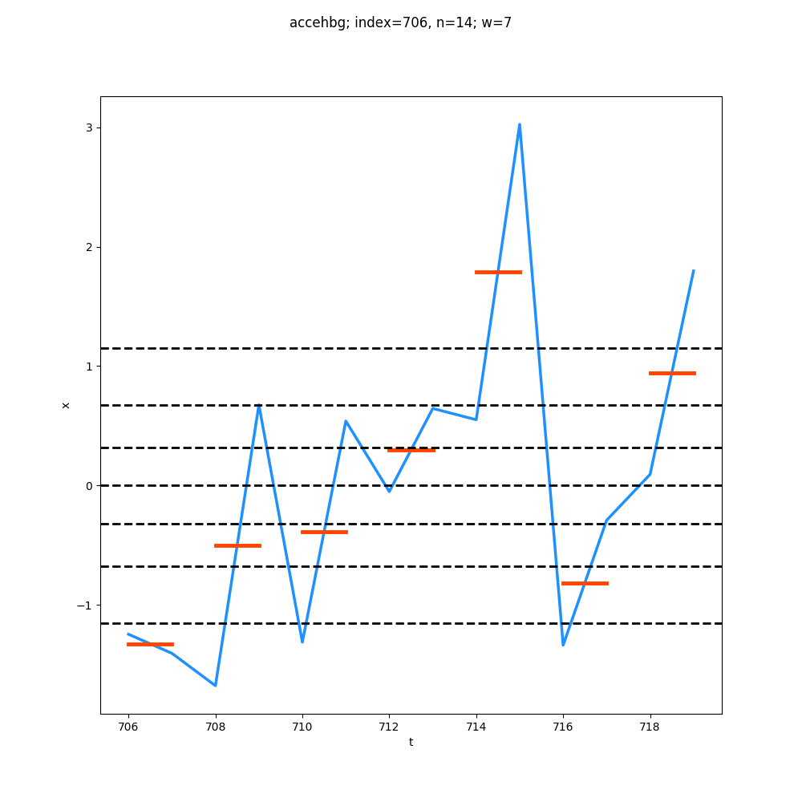
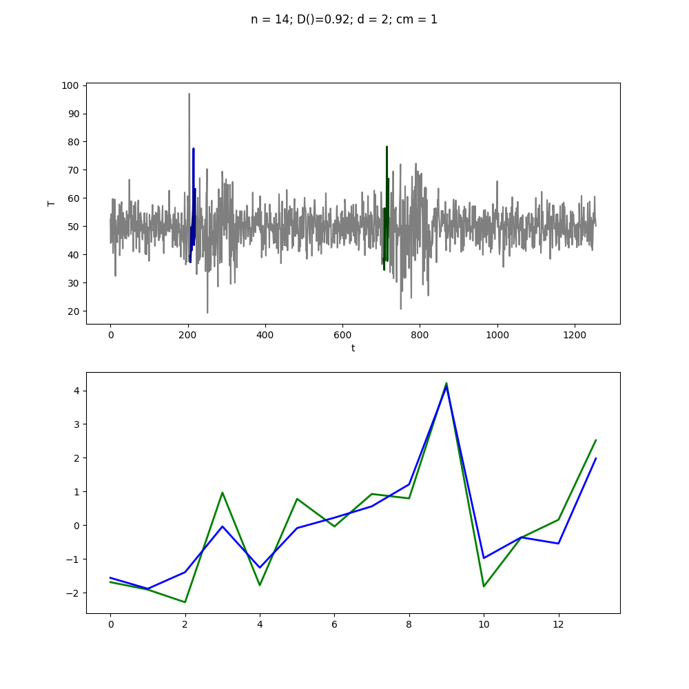

# Time Series Motif Detection

Python implementation of [Probabilistic Discovery of Time Series Motifs by Eamonn Keogh](https://www.cc.gatech.edu/~isbell/reading/papers/p493-chiu.pdf).

##### Piecewise Aggregate Approximation 

##### Segment Comparison 

